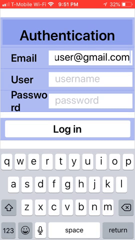
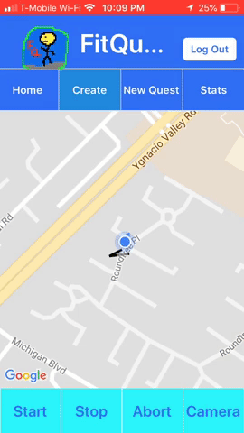
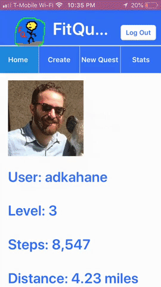
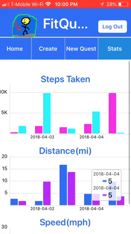

# FitQuest

## About Our App
  What is a Quest? According to Oxford a quest is  '_a long arduous search for something_'. In other words life is a quest. And in
life, you can take mini quests to acheive personal goals.
   Our app is aimed at helping people find Fitness. FitQuest is an app that encourages people to track walks, runs, and rides and
calls them **_Quests_**.

## Team Members
* Adam Kahane
* Joel Hernandez
* Mark Mikelonis
* Brandan Richardson
* Pedram Sharif

## Where to Go
   Are App is located in Expo's Published Projects Area on __https://expo.io/@adkahane/fitquest__. You can connect to to it by
downloading Expo Client on your Android or iOS device. Then Scan Our QR Code which will looks like this below.

## Technologies Used
* __Javascript__ The Language used for the app.
* __React__  The framework that renders view components and handles client events.
* __React-Native__ The framework that makes react components usable for mobile apps.
* __Expo__ The framework used to translate our code to be used for Android and iOS operating systems.
* __Node.js__ The server side technology we used to send and recieve data.
* __MongoDB__ The database used to save Quest and User information.
* __Express__ The Node Package that allowed us to route our users to the correct pages.
* __Firebase Auth__ To authorize our users to use our app.
* __Expo Location__ and __Expo React-Native-Maps__ API's To track users on their quests.
*__Expo Camera__ To Render our camera screen whenever a user needs to take pictures of waypoints.
* __React-Native-Elements__ A react-native library used to render pre-styled components.
* __React-Native-Pure-Chart__ As our Front End CSS Library to style out pages __CSS__ To customerize styles.

## Logging in

We used FireBase Authentication to Log our users into our App.

A user will be registered to our app if they enter a password that is more than 7 characters long and enter a valid email and username.

A User can also log out if they click the small logout button located in the header of our app.

## CreatingQuests
A user can tap __Create__ in our NavBar to create a quest for our App. It will prompt the user for their location.

   When the user presses start a map will start tracing the quest that the user is going on.
When a user presses Camera they can take pictures of waypoints. Waypoints are points of interest on a quest.
If users challenge a quest the waypoints will be markers where users can earn points by locating the waypoints.
If they press stop the quest has finished.

## ChallengeQuests
   A user can tap __New Quest__ if they want to challenge a quest that has already been made. It will draw them a map of the
route they are they are challenging.

  A user will be able to start the quest. Stop the Quest and Abandon the Quest if they do not want to complete it.
  (Not Yet Completed: They will also be reminded of the waypoints that the creator of the quest charted. )
  
  ## Stats
   A user can click on __Stats__ to see how they are performing on their quests.
   
   
   
   It will show them their Steps Taken. Distance they covered and their average speed for their quest. We plan on also making it
so that the quest will score users based on waypoints and accomplishments like fastest time, but it is in the works at the moment.

## Planned Future Features
* We'd like to store more user information to our database.
* We'd like to store more quests for users to challenge on our database with waypoints and stats to show to users.
* Style everything to be a bit more user friendly.
* Make navigation a beat more seamless to take users from screen to screen without running into issues.
* Provide a list of challenges for the users to challenge based on difficulty.
* Gamify the quests a bit more by adding extras like waypoint validation to motivate users.
* Add styling on routes to mark where they should head, and where start and stop points are.

